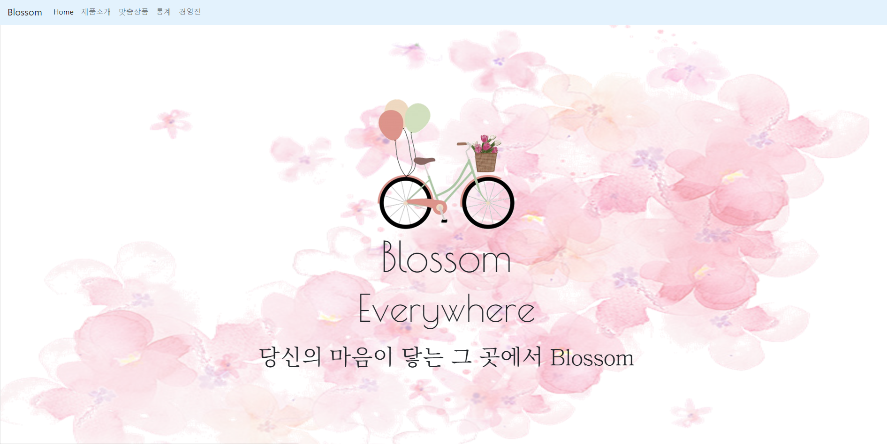
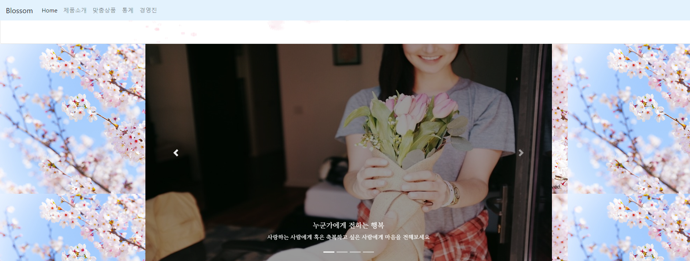
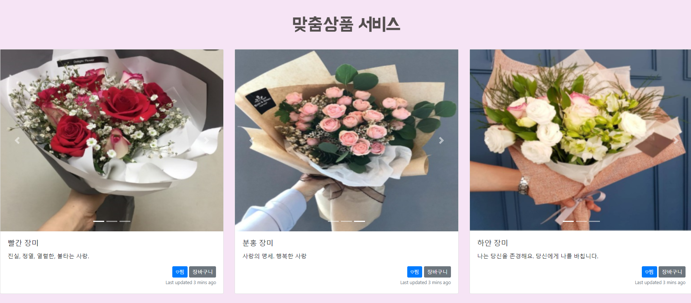
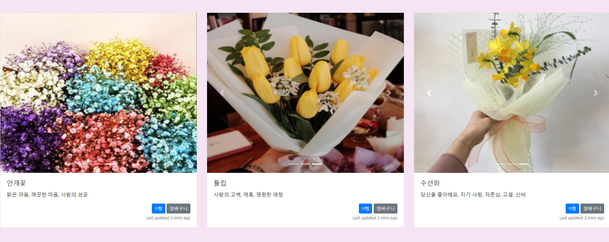
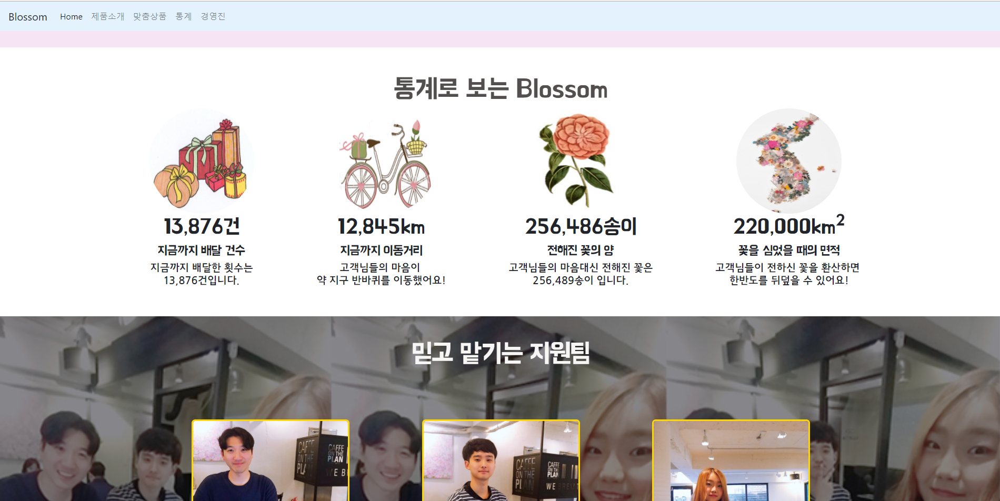
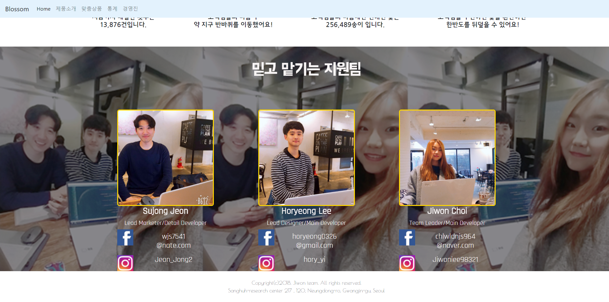
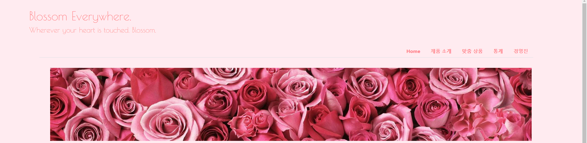
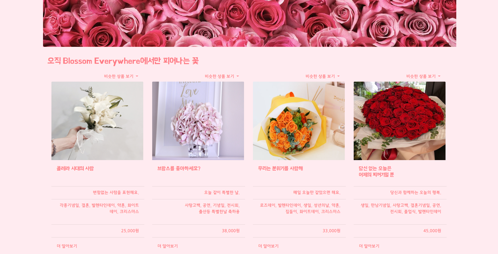

# <구현의도>
꽃의 계절인 봄에 맞게 "꽃을 배달해주는 서비스의 랜딩페이지"를 구현해보았습니다.
 네비게이션바에는 저희 팀이 구현한 내용인 Home, 제품소개, 맞춤상품, 통계, 경영진으로 구성했습니다. 또한 각 탭을 클릭하면 각 콘텐츠로 이동할 수 있도록 설정하였으며 스크롤을 내렸을 때도 네비게이션바는 사라지지않도록 구현했습니다.
 Home탭에서는 저희 팀 서비스의 이름인 "Blossm Everywhere"와 서비스 문구인 "당신의 마음이 닿는 그 곳에서 Blossom"으로 '랜딩페이지'의 목적에 맞게 한 눈에 들어오고 서비스의 의도록 포괄할 수 있도록 하였습니다.
 제품소개탬에서는 저희 서비스의 특징을 전체적으로 설명할 수 있도록 구현하였습니다. 또한 자전거이미지를 클릭하면 다음 세부페이지로 넘어갈 수 있도록 링크를 걸어두었습니다.
 맞춤상품탭에서는 종류별 꽃을 3개씩 배치하고 꽃의 사진이 자동적으로 넘어가도록 하였으며 꽃의 이름과 꽃말을 덧붙였습니다.
 가상의 서비스이기때문에 아직 통계 자료는 없으나, 가상으로 통계자료도 구성해보았습니다.
 경영진탭에서는 팀원들의 프로필을 간단하게 구성해보았습니다.

# <역할분담 내용>
-수종 : 세부페이지 구현/서비스 네임, 문구 구상
-호령 : 메인페이지 네비게이션, home, 제품소개 파트 구현/폰트 등 디자인 구상
-지원 : 메인페이지 맞춤상품, 통계, 경영진 파트 구현
# <조원별 오류 내용 + 오류 해결방법>

-수종 
1) 배너에 이미지를 넣는 과정에서 반복되어 사진이 단절되어 보이고, 배너에 스크롤바가 생김

 -> 이를 해결하고자         
		background-repeat: no-repeat;
        background-attachment: fixed;
        background-position: center top;
        위와 같은 기능을 추가하여 해결
        
 2) 4개의 카드를 나란히 두고, 배너 크기에 맞추고 싶었으나 쉽지 않았다.

-> 이를 해결하고자
      .card1, .card2, .card3, .card4 {
        width: 23%;
        float: left;
        margin: 1%;
      }
위와 같은 기능을 추가하여 해결

-호령 
div에 배경이미지 넣는 방법 => 부트스트랩에서 div 전체를 카드형식으로 지정하여 카드의 배경으로 이미지를 집어 넣음 
이미지 위에 텍스트 혹은 사진 올리기 => 카드형식으로 지정된 이미지위에 새로운 이미지와 텍스트를 삽입하였습니다. 
이미지 위에서 텍스트&그림 중앙 정렬 =>  align 형식이 style 안에 들어가는 건줄 알았는데 별개였다는것을 알고 지정해 주었습니다. 
텍스트 폰트 바꾸기 => Doit! 책에서 배운 방법을 통해 import로 폰트 URL을 지정해주고 클래스를 지정해 주어 각각의 텍스트에 어울리는 폰트를 지정했습니다. 
여백지정 => 여러개의 div를 생성하면서 각각의 div의 콘텐츠들이 맨위와 맨아래에 달라 붙어 미관상 별로 였던 점을 style="padding-top"을 통해서 지정해 주었습니다.

-지원 
"맞춤상품"탭을 구성할 때 부트스트랩에서 carousel을 사용하여 사진 슬라이드가 넘어가는 것을 표현하고 싶었습니다. 한 줄에 꽃 3종류씩 배치하고 싶었으나, 1종류씩밖에 배치되지 않았습니다. 
=>카드를 우선 한 줄에 3개씩 배치하고 그 내부에 carousel을 배치함으로써 문제를 해결할 수 있었습니다. 
"통계"탭을 구성할 때 이미지를 한 줄에 나란히 배치하고 싶었으나, 세로로만 배치되었습니다. 
=>각 이미지와 해당 내용을 div로 나누었고 div의 스타일에서 display를 inline-block으로 설정하여 해결할 수 있었습니다.

# <간단한 소감>

-수종 
저번에 자기소개 페이지를 만들 때, 책과 공부로 배운 것과 실제로 실현해보는 것은 참으로 다르다고 느꼈었다. 그러면서 얻은 교훈을 통해 다음번에는 더 잘하리라 다짐했었다. 이번 페이지 제작은 개인적으로 저번보다 성장한 것 같아, 기분이 나쁘진 않다. 하지만 팀이 되어 협력하는 것은 또 다른 일이라는 걸 알게 되었다. 다른 생각을 가진 사람들과 머리를 맞대고 결과물을 내는 것이 협력이었다. 그러한 경험을 많이 해보지 못한 나로서는 걱정이 앞섰지만, 멋지게 해낸 것 같다. 그리고 개인 작업을 통한 결과물보다, 팀을 꾸려 만든 결과물이 훨씬 보람차고 뜻 깊었다. 아직 많이 부족한 나인데, 팀원들 각자 맡은 바를 성실히 해줘서 괜찮은 결과가 나온 것 같다. 결과물을 보며 팀원들에게 커다란 고마움을 느낀다. 

-호령 
처음으로 도전해보는 팀플 코딩에서 무슨일을 할 수 있을지 걱정이 굉장히 많았습니다. 나혼자서 혹시나 짐이 되는건 아닐까 다른 사람들이 다 잘해오는데 나만 형평없는건 아닐까 고민을 계속 했었는데 이 걱정 덕분에 좀 더 열심히 할 수 있는 계기가 될 수 있었다고 생각합니다. 팀 회의 전에 각자 해야 할 일을 분배 했고 회의까지 맡은 일을 해갔습니다. 완벽하지는 않았지만 처음 과제였던 자기소개 페이지를 만들 때의 경험과 랜딩페이지를 만드들면서 스스로 고민했던 부분들이 합쳐져 전보다 나아진 결과물을 만들어낼 수 있었습니다. 그리고 팀 회의 때는 기존에 가지고 있던 궁금증이 어느정도 해결이 되었고  혼자라면 하지 못했을 여러가지 방법들을 시도할 수 있었습니다. 팀플을 통해서 시너지를 낸다는 것이 얼마나 중요한지 알게 해준 좋은 경험이었습니다.

-지원 
막연하게 '랜딩페이지'를 만들려다보니 주제설정에서부터 막막했었습니다. 혼자했었다보면 막막한 점도, 고민되는 점도 많았을텐데 수종오빠의 아이디어와 호령오빠의 디자인감각 덕분에 더 수월하고 재밌게 진행했습니다. 다른 서비스의 랜딩페이지를 살펴봤을 때 이런걸 과연 어떻게 만들까 싶었는데 팀원들과 구상부터 차근차근 진행하고 의견을 나누고 구상에 맞춰 역할을 나눠 진행하다보니 생각만큼 어렵진 않았던 것 같습니다. 물론 각자 구현하는데 있어서 막히는 부분들은 많았지만 이 또한 서로 물어보고 보완해주며 도와주니 괜찮았습니다. 자기소개페이지 만들때까지만 해도 아직 html과 css에 익숙하지 않아서 힘들었는데 랜딩페이지를 만들면서 실령향상에 굉장히 도움이 된 것 같습니다. 그때까지만 해도 아직 익숙하지 않았던 div나 margin 등의 개념도 하다보니 익숙해졌습니다. 저희 팀에는 웹 경험자가 없어서 시작할 때 팀원들 다 걱정하면서 시작하기도 했고, 더군다나 제가 전공자라고 조장을 하게 해주셔서 약간의 부담도 있었고 잘해야겠다는 생각도 있었는데 오히려 팀원들이 더 많이 도와주신 것 같아서 감사합니다. 그리고 컴퓨터공학 전공을 하면서도 팀프로젝트를 한 번도 해본 적이 없어서 걱정도 많았지만 오히려 큰 도움이 된 것 같아서 감사합니다. 

# <참고문서 링크>

-수종  
HTML&CSS 웹사이트 개발과 디자인 기초(책)

-호령 
https://fonts.google.com/?selection.family=Poiret+One
http://dongpal.tistory.com/2 : 중앙정렬
https://ofcourse.kr/css-course/background-%EC%86%8D%EC%84%B : div에 배경이미지 넣기 

-지원 
HTML5+CSS3+JavaScript로 배우는 웹프로그래밍 기초(책)

# 스크린샷

 

 

 

 

 

 

 

